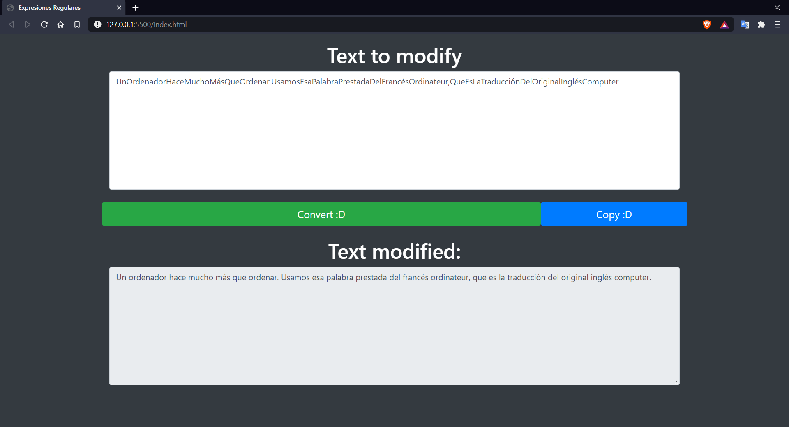

# PascalCase-To-Text🔧

## Introduccion🧠

- En este proyecto encontraremos un programa el cual nos permite ingresar un texto en Pascal case y convertirlo a texto.
- Este programa hace uso de expresiones regulares, tema del cual vamos a encontrar un breve resumen.
- Tambien encontraremos un texto que se puede seguir como ejemplo.

## Instalacion⚙️

- Este proyecto no requiere la instalacion de ningun programa extra.

## Recomendacion👾

- Ejecutar en un server local, recomiendo la extencion [Live Server](https://marketplace.visualstudio.com/items?itemName=ritwickdey.LiveServer)
- 
## Screenshots📸

## Prueba 🎮

[Click aqui](https://juan-chapur.github.io/PascalCase-To-Text/) para probar :D
